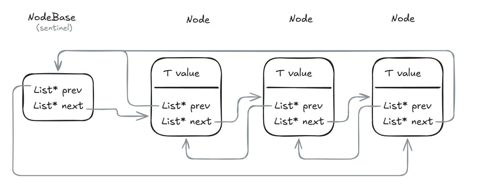
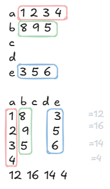

# List cpp lib with tests and usecase 

## Project

The task in university of was to create a memory safe list implementation on raw pointers with tests and TDD and write a simple transposition algorithm using the fresh written API.





# Task
The task was to transpose matrix and return names and row-wise sums





# Running 

```
make run
```

```
make build
```

```
make test
```